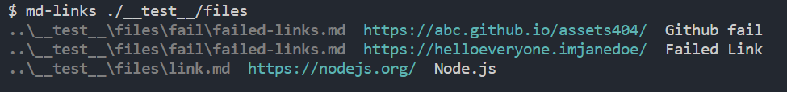
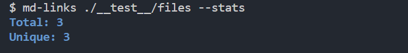
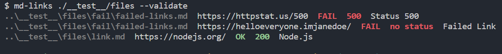
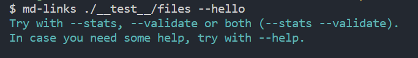
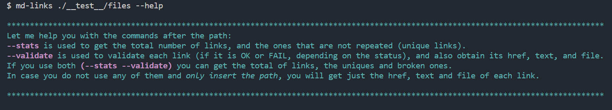
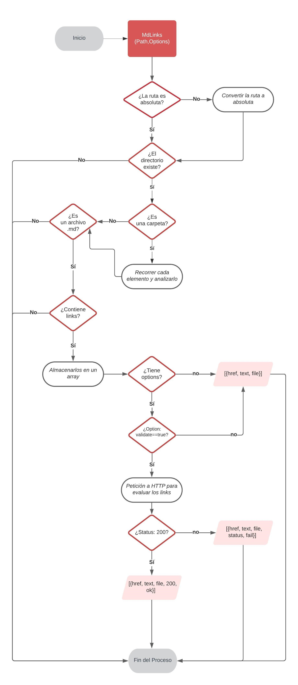
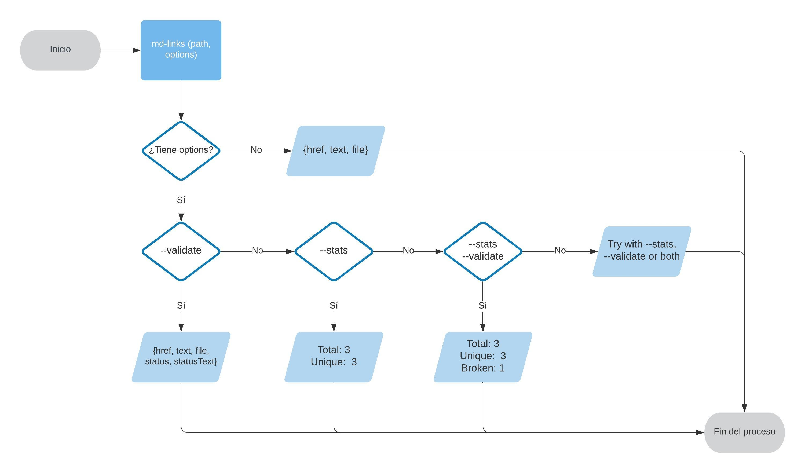

# Markdown Links

La librería `md-links` -creada con [Node.js](https://nodejs.org/)- se encarga de leer y analizar los archivos en formato
[Markdown](https://es.wikipedia.org/wiki/Markdown)  para verificar los links que contengan y reportar algunas estadísticas, ya que muchos de estos links pueden encontrarse rotos o ya no son válidos y perjudican el valor de la información que se desea compartir.

## INSTALACIÓN

Puede instalarse de la siguiente forma: 

`$ npm i lim014-mdlinks`

## GUÍA DE USO
En la línea de interfaz de comando (CLI), se coloca lo siguiente:

`md-links <path-to-file> [options]`

Si solo se coloca la ruta sin opciones, retornará el file, href y text de cada uno de los links encontrados.

Si se coloca la opción `--stats`, el resultado serán el total de links encontrados y los links únicos (sin repetir).

Si se coloca la opción `--validate`, retornará el file, href y el texto de los links encontrados, además del status (200, 404, 500) y su mensaje respectivo (ok o fail).

Si se colocan ambas opciones (`--stats --validate`), arrojará la cantidad total de links, así como de los links sin repetir y de los que estén rotos.

En caso se coloque alguna otra opción no válida, la consola arrojará lo siguiente: 

Y si se intenta con la opción `--help`, se mostrará para qué sirve cada una de las opciones a insertar en el CLI.

## DIAGRAMAS DE FLUJO
Para poder realizar esta librería, se realizaron 2 diagramas de flujo para cada tipo: uno del API donde se pondrían las funciones principales, y uno para el CLI con los resultados que saldrían al colocar o no ciertas opciones.

### 1) API

### 2) CLI (Command Line Interface - Interfaz de Línea de Comando)

