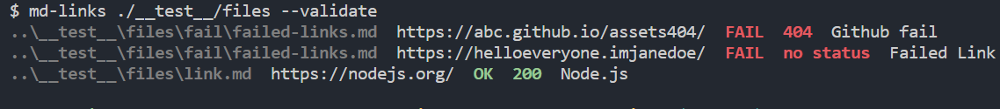

# Markdown Links

La librería `md-links` -creada con [Node.js](https://nodejs.org/)- se encarga de leer y analizar los archivos en formato
[Markdown](https://es.wikipedia.org/wiki/Markdown)  para verificar los links que contengan y reportar algunas estadísticas, ya que muchos de estos links pueden encontrarse rotos o ya no son válidos y perjudican el valor de la información que se desea compartir.

## INSTALACIÓN

`$ npm i lim014-mdlinks`

## GUÍA DE USO

### API

Para acceder a `mdLinks`, debemos importarla con  

`const mdLinks = require('lim014-mdlinks')` 

Esta es una promesa que recibe dos parámetros: `path` (ruta absoluta o relativa) y `option`, retornando un array de objetos por cada link encontrado con sus propiedades (href, text y file).


**Ejemplos de uso:**
```js
const mdLinks = require("md-links");

mdLinks("./some/example.md")
  .then(links => {
    // => [{ href, text, file }]
  })
  .catch(console.error);

mdLinks("./some/example.md", { validate: true })
  .then(links => {
    // => [{ href, text, file, status, ok }]
  })
  .catch(console.error);

mdLinks("./some/dir")
  .then(links => {
    // => [{ href, text, file }]
  })
  .catch(console.error);
``` 

### CLI
En la línea de interfaz de comando (CLI), se coloca lo siguiente:

`md-links <path-to-file> [options]`

Si solo se coloca la ruta sin opciones, retornará el file, href y text de cada uno de los links encontrados.


Si se coloca la opción `--stats`, el resultado serán el total de links encontrados y los links únicos (sin repetir).


Si se coloca la opción `--validate`, retornará el file, href y el texto de los links encontrados, además del status (200, 404, 500) y su mensaje respectivo (ok o fail).



Si se colocan ambas opciones (`--stats --validate`), arrojará la cantidad total de links, así como de los links sin repetir y de los que estén rotos.


En caso se coloque alguna otra opción no válida, la consola arrojará lo siguiente: 


Y si se intenta con la opción `--help`, se mostrará para qué sirve cada una de las opciones a insertar en el CLI.


## DIAGRAMAS DE FLUJO
Para poder realizar esta librería, se realizaron 2 diagramas de flujo para cada tipo.

### 1) API


### 2) CLI (Command Line Interface - Interfaz de Línea de Comando)


